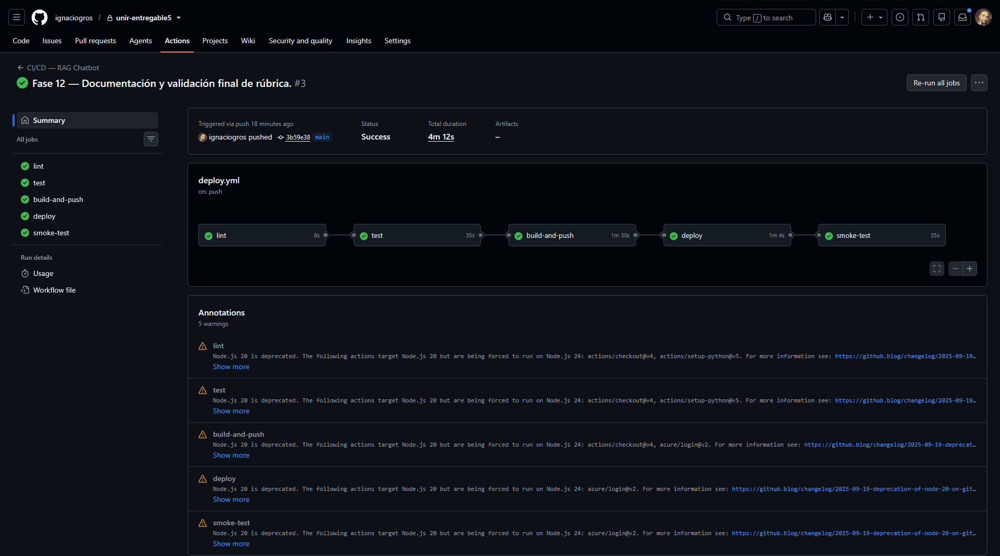
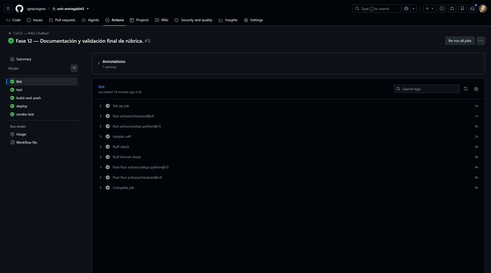
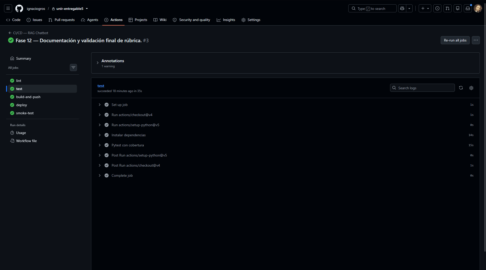
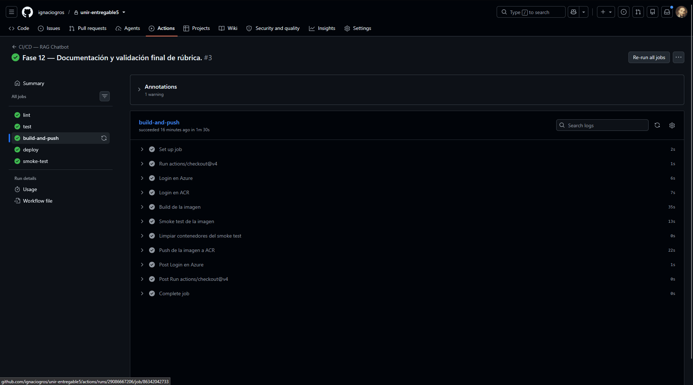
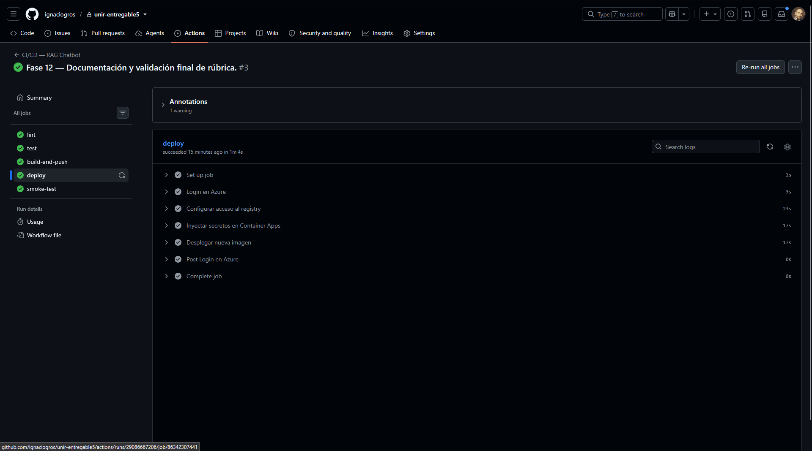
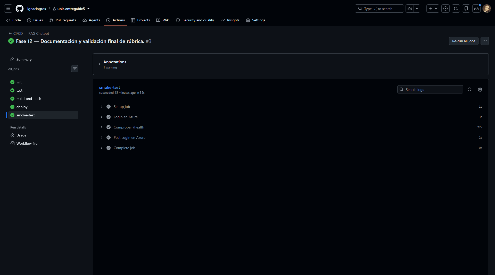

# Pipeline CI/CD

Definido en [`.github/workflows/deploy.yml`](../.github/workflows/deploy.yml). Se dispara con cada
`push` a la rama `main`, y también manualmente desde **Actions → Run workflow**.

Son cinco *jobs* encadenados con `needs:`. Cada uno arranca **solo si el anterior termina en verde**,
de modo que un fallo de lint impide que se ejecuten los tests, un fallo de los tests impide construir
la imagen, y así sucesivamente. Nada llega a producción sin haber pasado todas las puertas.

```
lint ──► test ──► build-and-push ──► deploy ──► smoke-test
```



---

## 1. `lint` — estilo y errores estáticos



```bash
ruff check .          # errores de sintaxis, imports sin usar, variables muertas
ruff format --check . # formato consistente, sin reformatear nada
```

Instala únicamente `ruff`, no todas las dependencias del proyecto: el análisis estático no necesita
FastAPI ni el SDK de Azure OpenAI, y así el *job* termina en segundos.

`ruff format --check` **no modifica ficheros**, solo falla si el formato difiere del canónico. Es
deliberado: el pipeline avisa, y el desarrollador arregla en local con `ruff format .`.

---

## 2. `test` — pruebas unitarias con cobertura



> **Dónde están las pruebas de integración.** Este *job* cubre las **unitarias**. Las de
> **integración** se ejecutan más adelante, sobre artefactos reales en lugar de mocks: el *job*
> `build-and-push` levanta la imagen contra un PostgreSQL y un Qdrant de verdad, y el *job*
> `smoke-test` ejerce la aplicación ya desplegada contra sus bases de datos de producción. Las tres
> capas se describen abajo.

```bash
pytest tests/ -v --cov=app --cov-report=term-missing --cov-fail-under=80
```

La suite cubre autenticación, panel de administración, ingesta, almacén de vectores, pipeline RAG,
chat, base de datos y endpoint de salud.

Corre **sin servicios externos**: PostgreSQL se sustituye por SQLite en memoria, y Qdrant y Azure
OpenAI están mockeados. Eso hace que el *job* sea rápido, determinista y gratuito, sin consumir
cuota de Azure OpenAI en cada *commit*.

`--cov-fail-under=80` convierte la cobertura en una puerta real: si baja del 80 %, el *job* falla y
el despliegue no ocurre.

---

## 3. `build-and-push` — construir, **probar la imagen** y publicarla



Este *job* hace tres cosas, en este orden:

**a) Construir.** `docker build` con el `Dockerfile` multi-stage, etiquetando la imagen dos veces: con
el SHA del *commit* (`:a1b2c3d…`) y con `:latest`. La etiqueta por SHA es la que se despliega, y
permite saber con exactitud qué código corre en producción y volver atrás a cualquier revisión.

**b) Probar la imagen antes de publicarla.** Los tests del *job* anterior se ejecutan sobre el código
fuente, no sobre la imagen. Podrían pasar y, aun así, la imagen estar rota: una dependencia que falta
en el `Dockerfile`, un `CMD` mal escrito, un permiso del usuario no-root. Para descartarlo, se levanta
la imagen recién construida contra un PostgreSQL y un Qdrant efímeros, en una red de Docker dentro del
*runner*, y se exige que `/health` responda:

```json
{"status":"ok","postgres":"connected","qdrant":"connected", ...}
```

Se exige `"ok"`, no `"degraded"`. Es decir, no basta con que el contenedor arranque: tiene que
**conectar de verdad con la base de datos**. Si no lo consigue en 20 intentos, el *job* vuelca los
logs del contenedor y falla, y **la imagen nunca llega al registro**.

> Un `docker run` de la imagen sin base de datos delante no serviría: al arrancar, la aplicación crea
> las tablas contra PostgreSQL, y si no lo alcanza el proceso termina antes de poder responder a nada.

**c) Publicar.** Solo si el smoke test pasó, `docker push` sube ambas etiquetas al Azure Container
Registry. Los contenedores de prueba se destruyen en un paso `if: always()`, ocurra lo que ocurra.

---

## 4. `deploy` — actualizar Azure Container Apps



Tres pasos:

1. **`az containerapp registry set`** — configura las credenciales con las que Container Apps
   descargará la imagen privada del ACR.
2. **`az containerapp secret set`** — inyecta los valores sensibles (usuario y contraseña de la
   aplicación, `SECRET_KEY`, clave de Azure OpenAI, cadena de conexión a PostgreSQL, credenciales de
   Qdrant Cloud) como **secretos de Container Apps**, leídos de GitHub Secrets.
3. **`az containerapp update --image ...:$SHA`** — despliega la imagen y define las variables de
   entorno, referenciando los secretos con la sintaxis `secretref:` en lugar de escribir sus valores.

El resultado es que **ninguna credencial queda en la imagen, en el repositorio ni en los logs del
workflow**. GitHub Secrets es la única fuente de verdad; Container Apps solo guarda referencias.

Container Apps crea una **revisión nueva** con la imagen actualizada y traslada el tráfico cuando está
lista, de modo que el despliegue no interrumpe el servicio.

---

## 5. `smoke-test` — validar el despliegue real



Obtiene la URL pública de la aplicación:

```bash
az containerapp show --name $APP --resource-group $RG --query properties.configuration.ingress.fqdn -o tsv
```

y consulta `https://<fqdn>/health` hasta 10 veces, con 15 segundos entre intentos, exigiendo
`200` y `"status":"ok"`.

Los reintentos no son un capricho: una revisión nueva de Container Apps tarda unas decenas de segundos
en aceptar tráfico, y sin espera el *job* fallaría contra un servicio que está a punto de estar listo.

Que se exija `"ok"` significa que el pipeline **solo termina en verde si la aplicación desplegada
responde y además alcanza su base de datos PostgreSQL y su base vectorial Qdrant**. Un despliegue que
arranca pero no conecta con sus dependencias se considera un fallo, no un éxito.

---

## Resumen de puertas

| Stage | Qué garantiza si pasa |
|---|---|
| `lint` | El código cumple el estilo y no tiene errores estáticos evidentes |
| `test` | La lógica funciona y la cobertura de tests no baja del 80 % |
| `build-and-push` | La **imagen** arranca, conecta con la base de datos, y está publicada en ACR |
| `deploy` | Azure Container Apps corre la imagen de este *commit*, con sus secretos inyectados |
| `smoke-test` | La aplicación **en producción** responde y alcanza PostgreSQL y Qdrant |

## Las tres capas de prueba

| Capa | Dónde | Qué ejercita | Dependencias |
|---|---|---|---|
| **Unitaria** | *job* `test` | Funciones y rutas de `app/`, aisladas | SQLite en memoria; Qdrant y Azure OpenAI mockeados |
| **Integración** | *job* `build-and-push` | La imagen Docker completa contra servicios reales | PostgreSQL 16 y Qdrant efímeros en el *runner* |
| **Extremo a extremo** | *job* `smoke-test` | La aplicación desplegada, desde Internet | Azure Database for PostgreSQL y Qdrant Cloud reales |

Cada capa prueba lo que la anterior no puede: las unitarias no ven el `Dockerfile`, las de integración
no ven la configuración de Azure, y las de extremo a extremo no sirven para diagnosticar qué línea de
código falló. Las tres juntas cubren el recorrido del *commit* hasta la URL pública.

---

## Secrets y variables

El workflow no contiene ningún valor sensible. Los toma de la configuración del repositorio, en
**Settings → Secrets and variables → Actions**.

**Secrets** (cifrados, no visibles tras guardarlos): `AZURE_CREDENTIALS`, `AZURE_OPENAI_API_KEY`,
`QDRANT_URL`, `QDRANT_API_KEY`, `DATABASE_URL`, `SECRET_KEY`, `APP_USER`, `APP_PASSWORD`.

**Variables** (no sensibles, visibles en los logs): `ACR_NAME`, `ACR_LOGIN_SERVER`,
`CONTAINER_APP_NAME`, `RESOURCE_GROUP`, `AZURE_OPENAI_ENDPOINT`, `AZURE_OPENAI_CHAT_DEPLOYMENT`,
`AZURE_OPENAI_EMBEDDING_DEPLOYMENT`.

Cómo obtener cada uno: [azure.md](azure.md).
